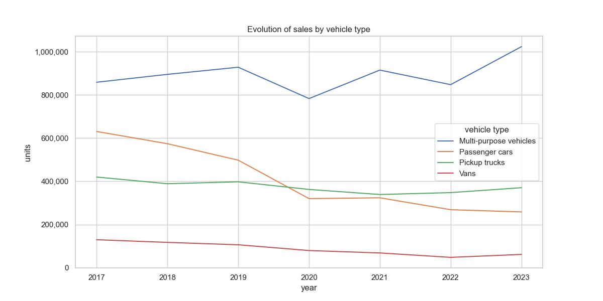
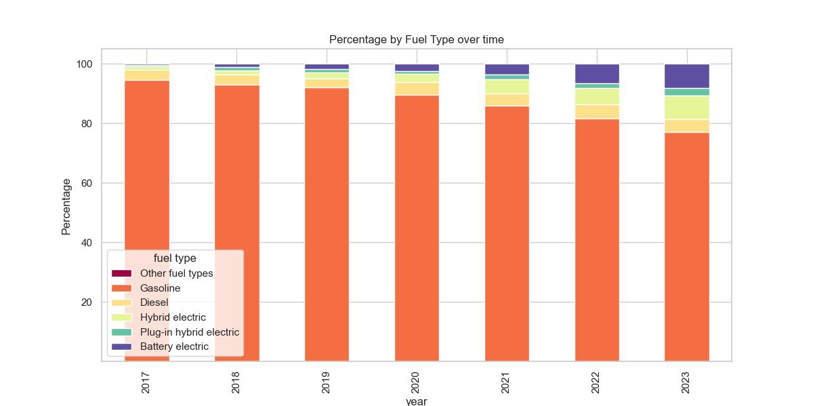

# Car sales in Canada
Analysis of new car sales in Canada

## What are the trends of new car sales in Canada?

### Passenger cars are replaced by Multi-purpose vehicules (SUV and crossovers)

### The proportion fo gasoline-only vehicules is gradually being replaced by battery and hybrids

#### About the dataset 

This survey looks at registrations of new motor vehicles in the provinces and territories in a given year.

- Estimates for Newfoundland and Labrador, Nova Scotia and Alberta are currently unavailable because of contractual limitations of the existing data sharing agreement. However, they are included in the Canadian total.
- Estimates for British Columbia include the territories.
- Other fuel types include liquid propane, natural gas, hydrogen, etcetera.
- Total vehicle type excludes buses, trailers, recreational vehicles, motorcycles, snowmobiles, golf carts, etcetera.
- Multi-purpose vehicles include sports utility vehicles (SUVs) and Crossovers.
- Pickup trucks correspond to gross vehicle weight rate (GVWR) ranging from 0-14000lb (for example, classes 1, 2, and 3).
- Vans include all minivans and cargo vans.

Source : [Statistics Canada. Table 20-10-0024-01  New motor vehicle registrations, quarterly](https://www150.statcan.gc.ca/t1/tbl1/en/tv.action?pid=2010002401)